# Search and AI-search APIs

Eleven APIs that return search results as structured data, with what each one actually bills for and where each one breaks. Google and Bing SERPs, the AI answer surfaces, and the independent indexes built for agents.

Every price was read from the vendor's own pricing page on **2026-08-12** and links to it. Where pricing is per-endpoint or quote-only, this list says so rather than inventing a number.

## Contents

- [Which one do I need?](#which-one-do-i-need)
- [SERP APIs](#serp-apis) · [SerpApi](#serpapi) · [DataForSEO](#dataforseo) · [Bright Data](#bright-data) · [Oxylabs](#oxylabs) · [cloro](#cloro) · [Scrapingdog](#scrapingdog) · [SearchApi](#searchapi)
- [Which of these cover the AI answer surfaces?](#which-of-these-cover-the-ai-answer-surfaces)
- [Independent indexes for agents](#independent-indexes-for-agents) · [Exa](#exa) · [Tavily](#tavily) · [Brave](#brave-search-api) · [Firecrawl](#firecrawl)
- [Also in this category](#also-in-this-category)
- [The five questions worth asking any vendor](#the-five-questions-worth-asking-any-vendor)
- [How this list is made](#how-this-list-is-made)

## Which one do I need?

| If you need | Category | Why |
| --- | --- | --- |
| Rank positions, ads, PAA, local pack from Google | SERP APIs | You want the results page as data |
| Whether ChatGPT names your brand, and what it cited | SERP APIs that cover AI surfaces | The answer, not the SERP behind it |
| Web results for a RAG or agent pipeline | Independent indexes | Cheaper, and ranking accuracy does not matter |
| A first-party feed with no scraping | Almost nothing, see below | Bing retired in 2025, Google Custom Search closes 2027-01-01 |

The most common mistake is buying from the first row when you needed the third. An independent index costs a fraction of a SERP API and cannot tell you where you rank on Google, because it is not reading Google.

## SERP APIs

### SerpApi

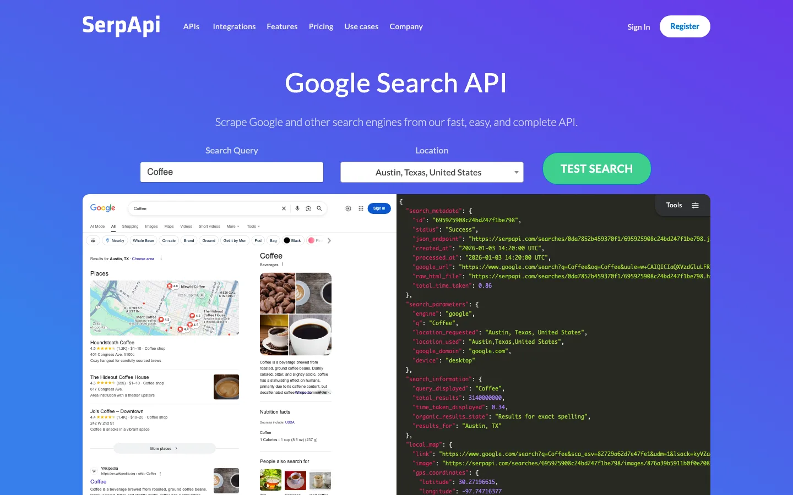

The widest engine coverage in the category, and the documentation everyone else is measured against. Google web, News, Shopping, Scholar, Patents, Jobs, Trends, plus Yandex, Baidu, Naver and DuckDuckGo.

**Pricing.** Starter **$25/mo for 1,000 searches**, Developer **$75/mo for 5,000** ([pricing](https://serpapi.com/pricing)). Plans also cap throughput per hour, which is a separate constraint from the monthly total: the Starter tier guarantees 200 successful searches an hour.

**The billing detail that decides your cost.** A search is one 10-result page. Since Google removed the `&num=100` parameter in September 2025, 100 results means ten pages, so a deep query bills ten times a shallow one. Evaluate at your real depth or the ranking of every vendor here changes underneath you.

**The thing you need to know before you commit.** Google [sued SerpApi in December 2025](https://blog.google/technology/safety-security/serpapi-lawsuit/) alleging circumvention of anti-bot protections under DMCA 1201. SerpApi [moved to dismiss in February 2026](https://www.vktr.com/ai-platforms/google-sues-serpapi-over-data-scraping/), arguing it returns only what a signed-out user sees. Unresolved as of August 2026. No court has ruled that scraping public results is unlawful and the suit targets circumvention rather than scraping, but if you are procuring for an enterprise, legal will ask.

### DataForSEO

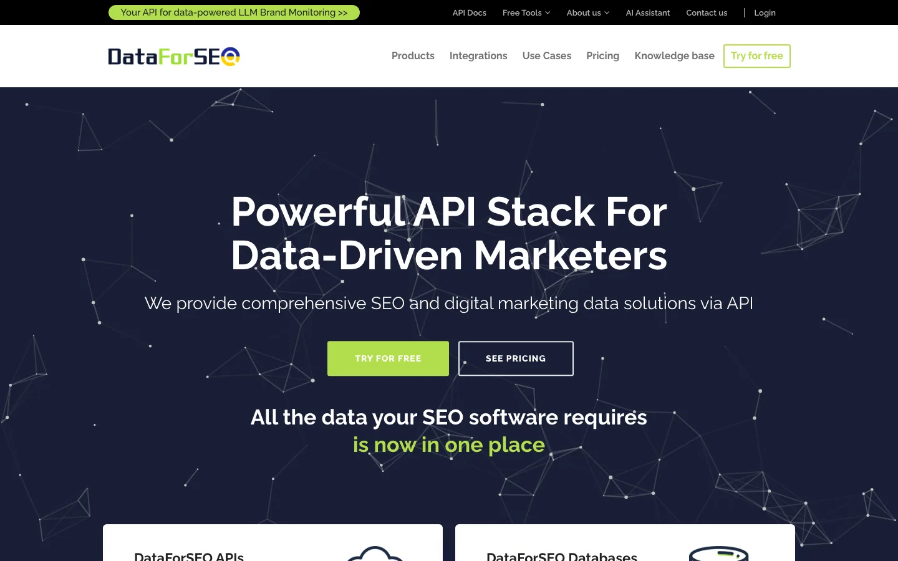

The cheapest option at volume and the most SEO-shaped: rank tracking, keyword, backlink and on-page endpoints sit alongside the SERP ones, so one vendor covers a whole rank-tracking product.

**Pricing.** Per endpoint rather than per plan, with a **$50 minimum payment** ([pricing](https://dataforseo.com/pricing)). There is no monthly subscription to outgrow, which is the main reason cost-sensitive teams end up here.

**The tradeoff.** Standard is a task-and-poll queue. You submit, wait, retrieve. Independent testing has put callback delivery around 12 seconds for 100 keywords and multiple minutes at production volume. That is irrelevant for an overnight rank tracker and disqualifying for anything real-time. The Live tier skips the queue and costs more.

**Watch the depth pricing.** DataForSEO moved to depth-based pricing in September 2025, so the per-call rate you model at 10 results is not the rate you pay at 100. AI Overview is an opt-in flag with its own surcharge rather than an included field.

### Bright Data

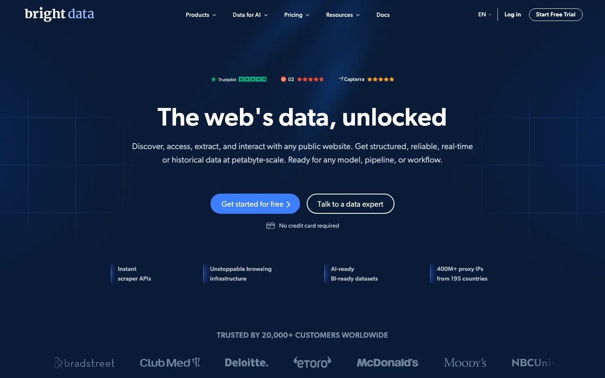

The largest proxy network in the category and the widest geographic coverage, with city-level targeting across essentially every country. If proxy infrastructure is your binding constraint rather than parsing, this is the tier above everyone else.

**Pricing.** Pay-as-you-go plus a minimum commitment, quoted rather than published. Expect enterprise procurement.

**Where it fits.** Its Scraping Browser is genuinely hard for anti-bot systems to block, and its own rank-tracking demo recommends 5 to 10 concurrent requests while documenting a 1 to 20+ range with no published ceiling, so concurrency is yours to tune and yours to monitor. Overkill below serious volume, and you still write the parsing layer for anything beyond the standard SERP shape.

**One caution on the numbers.** Bright Data's widely quoted 99.99% is a **success rate**, not an uptime SLA, and it comes from a benchmark whose author [disclosed a vested interest](https://hackernoon.com/serp-benchmarks-success-rates-and-latency-at-scale). Success rate measures request completion; uptime measures whether the endpoint answers at all.

### Oxylabs

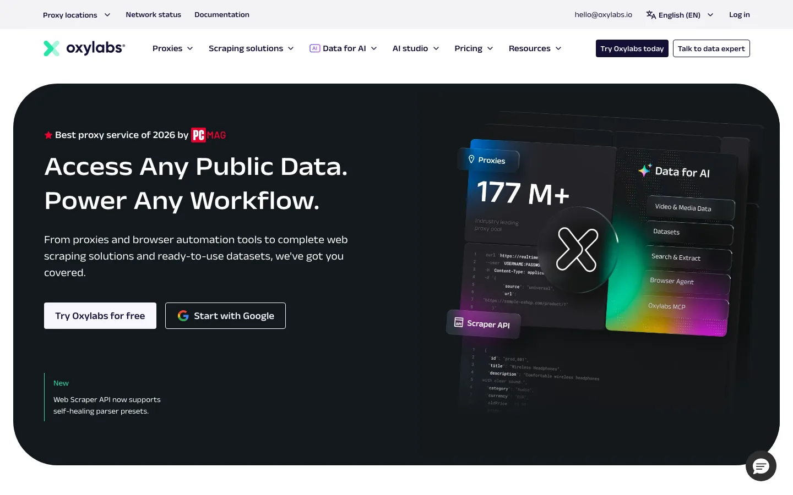

The closest comparable to Bright Data, and the best documented of the enterprise tier. Publishes open-source scraper repos per surface, including working examples for ChatGPT, Perplexity and Google AI Mode, which makes evaluation much faster than a sales call.

**Pricing.** Quote-based.

**Where it fits.** Same shape as Bright Data: buy it when scale and geographic reach are the problem. The public repos are the reason to start here rather than there, since you can read exactly what a response looks like before talking to anyone.

### cloro

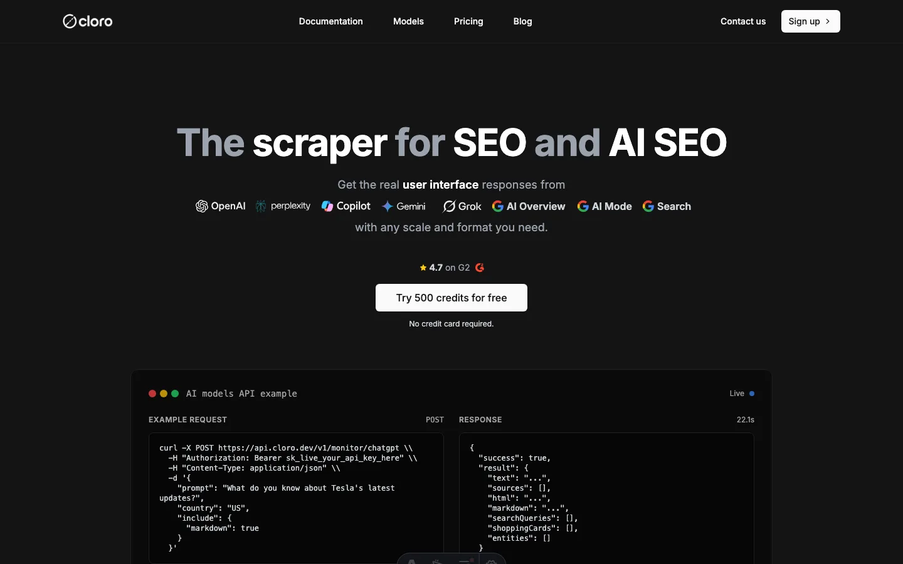

Google Search and Google News alongside one endpoint per AI surface: ChatGPT, Perplexity, Gemini, Copilot, Grok, Google AI Mode and AI Overview. Returns parsed citations, the query fan-out terms behind an answer, and shopping data as structured JSON rather than screenshots.

**Pricing.** Credit-based: free tier **500 credits a month**, Lite **$30/mo for 37,500 credits ($0.80/1,000)**, Hobby **$100/mo for 250,000 ($0.40/1,000)**, falling to $0.31 at the top self-serve tier ([pricing](https://cloro.dev/pricing/)). Calls cost different credits by surface: a ChatGPT web-search call is 5, Perplexity 3, Google Search 3 plus 2 per extra page.

**Where it fits.** Built for tracking what AI engines say about a brand, so the citation parsing is the product rather than a field on a SERP response. The [MCP server source is public](https://github.com/cloro-dev/mcp-server) if you want to read what runs before buying.

**Where it does not.** It is API-first with no dashboard, so if you want a report a marketing team reads, buy one of the visibility trackers instead. And below a few thousand queries a month, the maths does not favour any managed API over running Playwright yourself.

### Scrapingdog

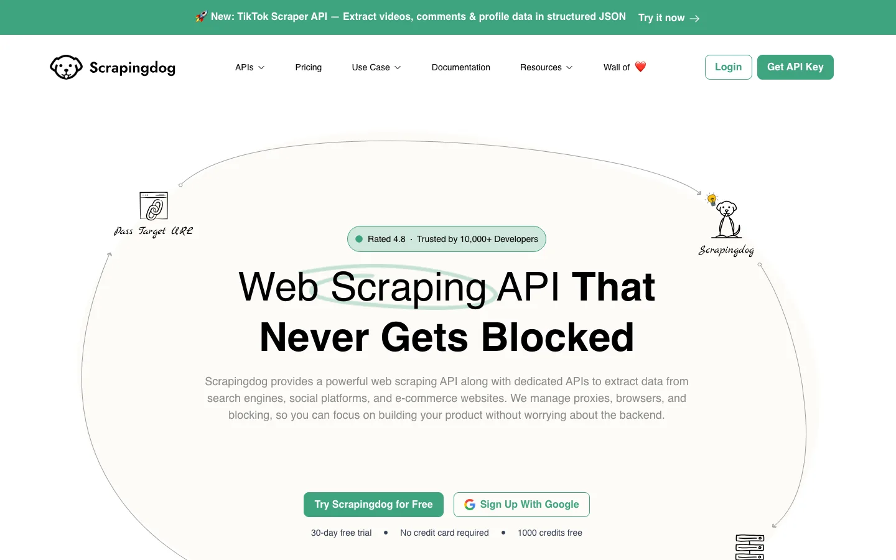

The aggressive-pricing end of the market, and a genuine option if your volume is high and your latency needs are not.

**Pricing.** Lite **$40/mo for 200,000 requests** ([pricing](https://www.scrapingdog.com/pricing/)).

**Read the concurrency, not the request count.** That entry tier is **5 concurrent requests**. 200,000 requests a month sounds generous until you try to dispatch them in a nightly window five at a time. Compare against ScrapingBee's 50 or ScraperAPI's 20 at a similar monthly price before deciding this is the cheap option.

### SearchApi

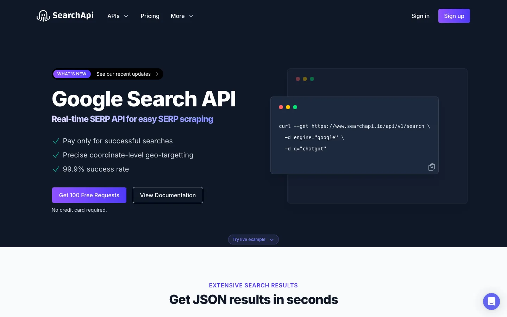

Straightforward per-search pricing with a clear ladder, and the easiest cost model on this page to reason about.

**Pricing.** Developer **$40/mo for 10,000 searches at $4 per 1,000**, Production **$100/mo at $3 per 1,000** ([pricing](https://www.searchapi.io/pricing)). Higher tiers keep lowering the per-1,000 rate.

**Where it fits.** Mid-volume teams who want predictable arithmetic rather than a credit pool. The per-search model means the `num=100` pagination change applies here the same way it does at SerpApi: price at your depth.

## Which of these cover the AI answer surfaces?

Reading what ChatGPT or Perplexity answered is a different job from reading a SERP. There is no ranking, and the citation list is the payload. Six of the vendors here do it, with real differences in how much parsing you get:

| Vendor | Surfaces | What comes back |
| --- | --- | --- |
| [cloro](#cloro) | ChatGPT, Perplexity, Gemini, Copilot, Grok, AI Mode, AI Overview | Parsed citations, query fan-out, shopping data |
| [Oxylabs](#oxylabs) | ChatGPT, Perplexity, AI Mode | Per-surface scrapers with public example repos |
| [Bright Data](#bright-data) | AI-surface endpoints alongside the SERP products | Same enterprise contract as the rest |
| [SerpApi](#serpapi) | AI Overview only | Returned as part of the Google endpoint, not a separate product |
| [Olostep](https://www.olostep.com) | ChatGPT, Perplexity, Gemini, Copilot, AI Overview, AI Mode | Batch requests, a [named parser per platform](https://docs.olostep.com/examples/geo) |
| [Scrapeless](https://www.scrapeless.com) | Similar per-platform split | Per-surface scraping |

The question to ask each of them is whether AI Overview comes back as structured fields or as raw HTML you parse yourself. One published benchmark found a major vendor detecting AI Overviews on only 68% of qualifying queries, and a missing Overview reads identically to an absent one, so that gap becomes invisible error in a trend line.

## Independent indexes for agents

Not scraping Google. Their own crawl and ranking, priced for RAG and agent loops.

### Exa

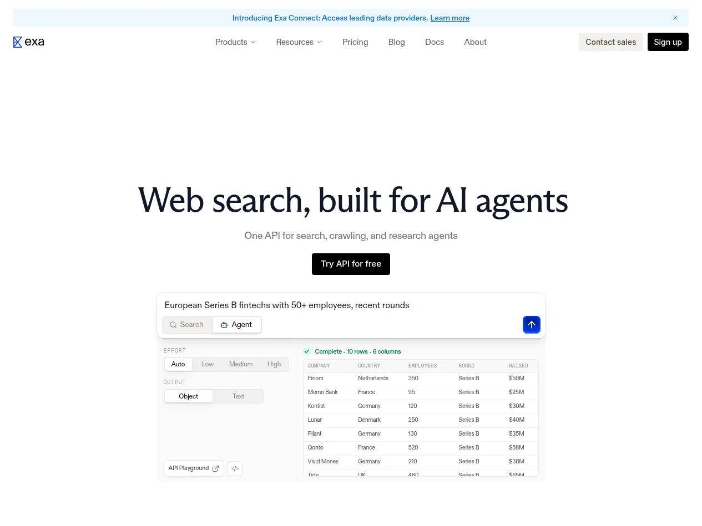

Neural search over its own index, built for agents rather than for SEO.

**Pricing.** **$7 per 1,000 requests** for search with page contents, and up to 1,000 results per search on higher tiers ([pricing](https://exa.ai/pricing)).

**What it cannot do.** Tell you where you rank, what the AI Overview said, or what a human sees on Google. It is not reading Google. That is a feature for agent retrieval and a dealbreaker for rank tracking, and confusing the two is the most expensive mistake in this document.

### Tavily

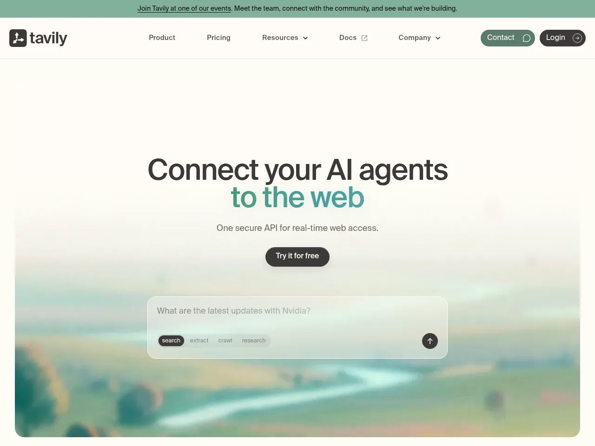

Built specifically for LLM agents, with the simplest pricing here.

**Pricing.** Free tier **1,000 API credits a month**, then **$0.008 per credit** pay-as-you-go ([pricing](https://www.tavily.com/pricing)). A basic search is one credit, an advanced search is two.

**Where it fits.** Prototyping and agent loops where you want an answer-shaped result and do not care which engine produced it. The free tier is large enough to build against before paying anything.

### Brave Search API

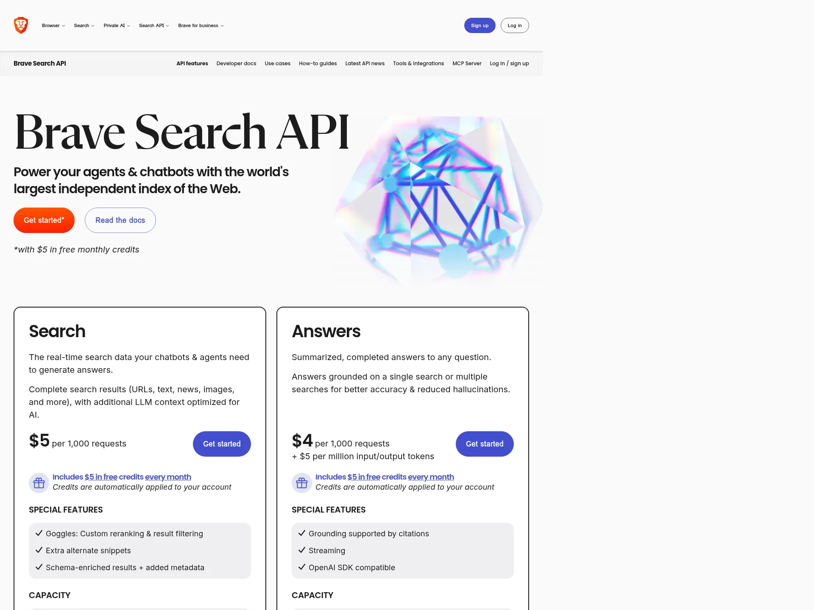

One of the few genuinely independent web indexes at real scale, rather than a reseller of someone else's results.

**Pricing.** **$5 in free monthly credits** on the entry plan ([details](https://brave.com/search/api/)).

**Where it fits.** Independence is the point: no dependence on Google's tolerance, and a different result set from anything Google-derived. If your use case needs Google specifically, that same independence is the reason it will not work.

### Firecrawl

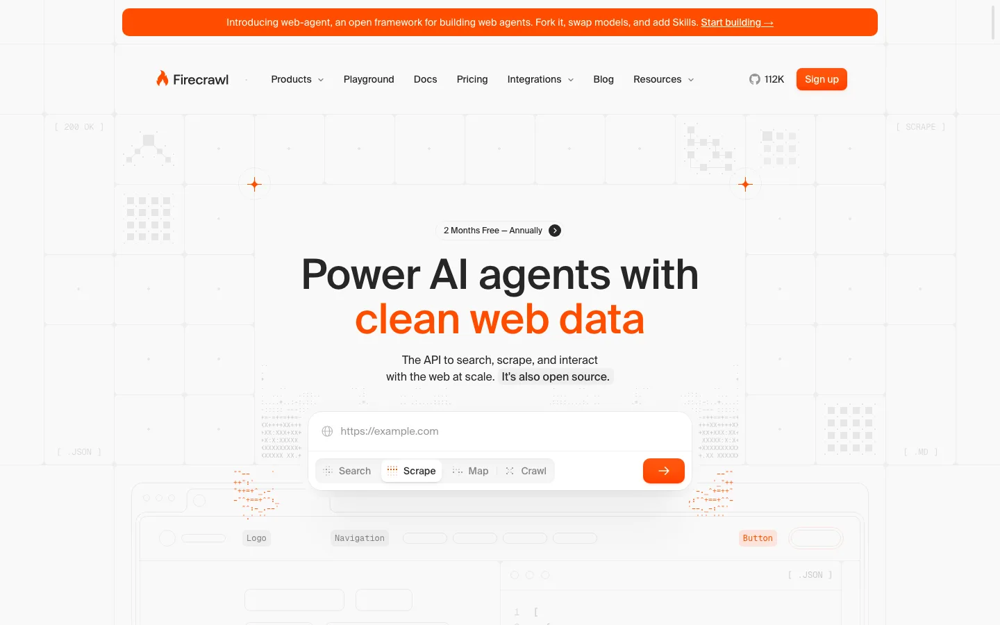

Crawl-and-extract rather than search. Point it at a site and get markdown back, which is the right tool when the job is ingestion rather than ranking.

**Pricing.** Hobby **$16/mo billed yearly for 5,000 pages, 5 concurrent** ([pricing](https://www.firecrawl.dev/pricing)).

## Also in this category

Worth knowing, without a full entry each: [ScraperAPI](https://www.scraperapi.com) (Hobby $49/mo, 100,000 credits, 20 threads, geotargeting limited to US and EU on that tier), [ScrapingBee](https://www.scrapingbee.com) (Freelance $49/mo, 250,000 credits, 50 concurrent), [ZenRows](https://www.zenrows.com) (Build $16/mo, 45,000 credits, 20 concurrent), [HasData](https://hasdata.com) (Startup $49/mo, up to 200,000 requests, 15 concurrent), [Serper](https://serper.dev) (very cheap, very fast, Google only), [Apify](https://apify.com) (an actor marketplace rather than a SERP API, reliability tracks whoever maintains the actor). [Olostep](https://www.olostep.com) and [Scrapeless](https://www.scrapeless.com) appear in the AI-surface table above.

For dashboards rather than APIs, the AI-visibility tracker category is a different purchase entirely: [Profound](https://www.tryprofound.com), [Peec AI](https://peec.ai), [Brandlight](https://brandlight.ai), [AthenaHQ](https://athenahq.ai), [OtterlyAI](https://otterly.ai), [Scrunch](https://www.scrunchai.com), [Evertune](https://www.evertune.ai) and others. Buy those if the output is a report someone reads.

## The five questions worth asking any vendor

1. **What does this cost at my depth?** Google removed `&num=100` in September 2025, so everyone paginates at 10 results a page. A per-search vendor multiplies by ten at 100 results; a credit-pool vendor may not. The cheapest option at n=10 is regularly the most expensive at n=100.
2. **Is a "supported engine" a real endpoint?** Coverage claims are cheap. Check whether each surface is its own implementation or a wrapper around the same Google call.
3. **Is that an uptime SLA or a success rate, and are credits attached?** Those are three different promises and vendors quote them interchangeably. A published percentage with no credit terms is a target, not a remedy.
4. **How are schema changes versioned?** A response tells you what the shape is today. Nothing in it tells you whether a field gets renamed next quarter, and that is the maintenance cost nobody prices.
5. **Where does the data come from?** Official feed, scraped results pages, or the vendor's own index. This has become a live legal question, not just an architectural one.

## The first-party options are closing

Most of why this category exists.

- **Google Custom Search JSON API** is **closed to new customers**, with existing customers on a clock to **2027-01-01** per [Google's own docs](https://developers.google.com/custom-search/v1/overview). Note what is not being retired: Programmable Search Engine itself continues, and the JSON endpoint plus the full-web search option are what go away. Most write-ups get this wrong.
- **Bing Search APIs** were **retired in August 2025**, with the replacement path routing through Azure AI Agent services rather than a direct search endpoint.
- **[Gemini grounding with Google Search](https://ai.google.dev/gemini-api/docs/google-search)** is first-party and returns grounded answers with source metadata, but it is a model feature rather than a search endpoint, so you cannot ask it for ranked results.
- **[Perplexity Search API](https://docs.perplexity.ai)** gives first-party access to Perplexity's own search and answers.

## How this list is made

Entries are chosen for being in production use and having documentation you can evaluate without a sales call. Prices come from the vendor's own pricing page, dated, and linked. Benchmark figures are attributed to whoever ran them, including when the benchmark's author had an interest in the outcome.

Corrections are welcome, including from vendors about their own products. See [CONTRIBUTING.md](CONTRIBUTING.md).
